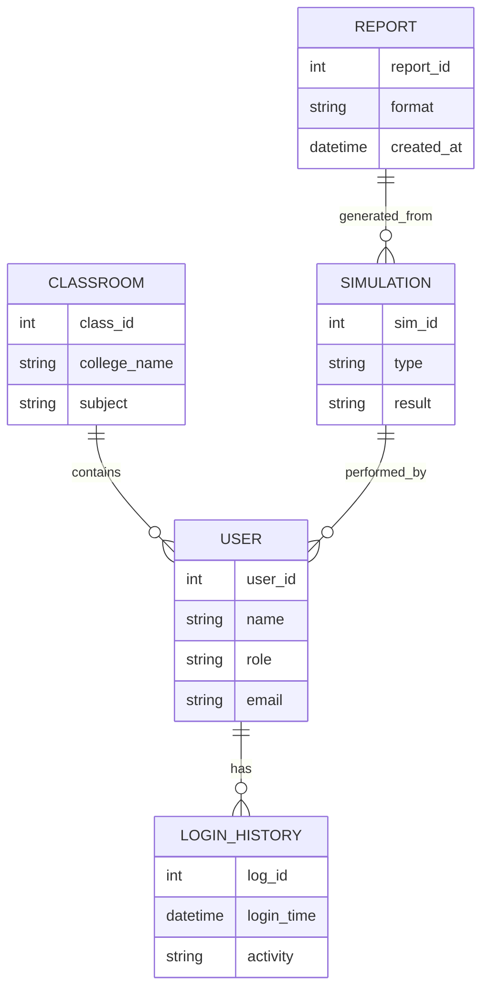
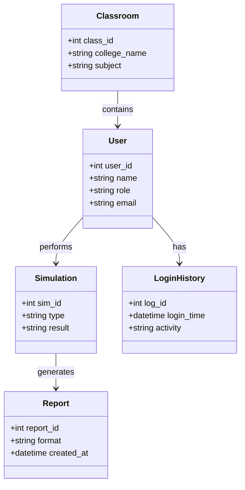

# CAT Learning Platform (Circuit Analysis & Technology)


---

## Project Overview

The CAT Learning Platform is an all-in-one educational ecosystem designed for Electronics and Communication Engineering (ECE) and Electrical and Electronics Engineering (EEE) students. It bridges the gap between theoretical textbook knowledge and practical lab simulation through a high-performance digital interface.

---

## Current Functions

### Advanced Circuit Simulation
- **Interactive Breadboard**: Functional $5 \times 60$ grid with snap-to-grid logic for precise component placement.  
- **Real-time Oscilloscope**: Side-by-side waveform analysis for sine, square, and sawtooth signals.  
- **Formula Integration**: Each component includes a slide-out with LaTeX-rendered formulas (e.g., $V = I \times R$) and detailed descriptions.  

### Analytics & Calculations
- **Matrix Solvers**: Built-in calculators for KVL and KCL.  
- **A-to-Z Reporting**: One-click PDF reports with full mathematical derivations.  

### Secure Infrastructure
- **Role-Based Access**: SQL-backed authentication for Editors and Users.  
- **Login History**: Tracks user activity, accessible only to Editors.  

---

## Advantages

| Feature | Advantage |
|---------|-----------|
| Interactive Breadboard | Provides hands-on circuit building experience digitally |
| Real-time Oscilloscope | Instant waveform visualization for better understanding |
| Formula Integration | Direct link between theory and practice |
| Matrix Solvers | Simplifies complex KVL/KCL calculations |
| Role-Based Access | Secure and organized user management |
| Result Syncing | Seamless teacher-student collaboration |
| Multi-Compiler Support | Enables Embedded C, Java, and IoT project development |

---

## Application Timeline

| Date | Milestone |
|------|-----------|
| Jan 2026 | Initial Research & Planning |
| Feb 2026 | Breadboard & Oscilloscope Module Development |
| Mar 2026 | Analytics & Matrix Solver Integration |
| Apr 2026 | Secure Infrastructure (SQL + Role-Based Access) |
| May 2026 | Teacher-Student Connectivity Prototype |
| Jun 2026 | Compiler Integration (Embedded C, Java) |
| Jul 2026 | Enhanced Learning Platform Release |
| Aug 2026 | Full Deployment & Institutional Testing |

---

## ER Diagram (Entity Relationship)



---

## UML Class Diagram


---

## Developed By

**Dhilipan S**  
Electronics and Communication Engineering Student  

Email: [dhilipan1804@outlook.in](mailto:dhilipan1804@outlook.in)  
LinkedIn: [Dhilipan S](https://www.linkedin.com/in/dhilipan-s)  

---

## Installation

The platform is available as a standalone application:  
- **Desktop**: `CAT_Platform_Setup.exe` for Windows PC/Laptops  

---

## Project Structure

```text
cat-learning-platform/

├── src/
│   ├── simulation/
│   ├── analytics/
│   ├── compilers/
│   └── auth/
├── docs/
│   └── user_manual.md
├── tests/
├── scripts/
├── README.md
└── LICENSE
```

---

## Security Principles
- Role-based access with SQL authentication.  
- Encrypted login history for accountability.  
- Strict separation of student and teacher privileges.  

---

## Future Vision
A connected learning ecosystem where students seamlessly transition from theory to practice, educators manage digital classrooms, and institutions adopt low-cost, scalable lab solutions for modern engineering education.
```
